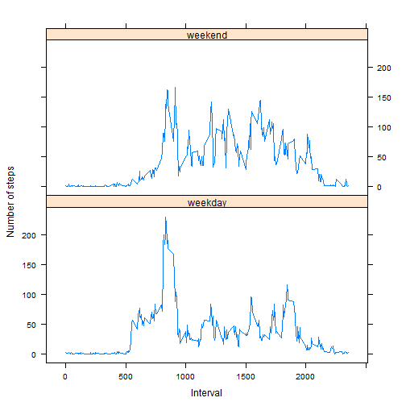

# Peer Assessment 1 - Reproducible Research

### Loading and preprocessing the data


```r
activitydf <- read.csv("activity.csv")
```

```
## Warning in file(file, "rt"): cannot open file 'activity.csv': No such file
## or directory
```

```
## Error in file(file, "rt"): cannot open the connection
```

```r
activitydf$date <- as.POSIXct(activitydf$date, format="%Y-%m-%d")
```

### What is mean total number of steps taken per day?
#### 1. Calculate the total number of steps taken per day


```r
totaldailysteps <- aggregate(activitydf$steps, list(activitydf$date), sum )
names( totaldailysteps ) <- c( "Dates", "TotalSteps")
```

#### 2. Make a histogram of the total number of steps taken each day


```r
with( totaldailysteps, {
  par(oma=c(2,0,0,0), mar=c(6.75,6.75,3,0), mgp=c(5.75,0.75,0), las=2)
  barplot(
    height=TotalSteps,
    main="Plot for total steps taken per day",
    xlab="Dates",
    ylab="Steps per Day",
    names.arg=Dates,
    space=c(0)
  )
})
```

 

#### 3. Calculate and report the mean and median of the total number of steps taken per day


```r
dlymean <- mean(totaldailysteps$TotalSteps, na.rm = TRUE)
dlymedian <- median(totaldailysteps$TotalSteps, na.rm = TRUE)
```

* Mean : 1.0766189 &times; 10<sup>4</sup>
* Median : 10765

### What is the average daily activity pattern?
#### 1. Make a time series plot (i.e. type = "l") of the 5-minute interval (x-axis) and the average number of steps taken, averaged across all days (y-axis)


```r
avgintervalSteps <- aggregate(
  data=activitydf,
  steps~interval,
  FUN=mean,
  na.action=na.omit
)

with(avgintervalSteps, {
  plot(
    x=interval,
    y=steps,
    type="l",
    main="Time-Series of Average Steps against Interval",
    xlab="5-minute Interval",
    ylab="Average Steps across all Days"
    
  )
})
```

 

#### 2. Which 5-minute interval, on average across all the days in the dataset, contains the maximum number of steps?


```r
intervalMax <- avgintervalSteps[avgintervalSteps$steps==max(avgintervalSteps$steps),]
```

* Data set containing maximum number of steps for 5-minute interval
** 835, 206.1698113

### Inputing missing values
#### 1. Calculate and report the total number of missing values in the dataset 


```r
missingNA <- sum(is.na(activitydf$steps))
```

* Missing values in dataset : 2304

#### 2. Strategy for filling the missing vlaues is to use the mean for the interval period


```r
stepValues <- data.frame(activitydf$steps)
stepValues[is.na(stepValues),] <- ceiling(tapply(X=activitydf$steps,INDEX=activitydf$interval,FUN=mean,na.rm=TRUE))
```

#### 3. Create a new dataset that is equal to the original dataset but with the missing data filled in.

```r
altData <- cbind(stepValues, activitydf[,2:3])
colnames(altData) <- c("Steps", "Date", "Interval")
```

#### 4. Make a histogram of the total number of steps taken each day 


```r
dailyStepSum <- aggregate(altData$Steps, list(altData$Date), sum)
names( dailyStepSum ) <- c( "Dates", "Steps")

with(dailyStepSum, {
  par(oma=c(2,0,0,0), mar=c(6.75,6.75,3,0), mgp=c(5.75,0.75,0), las=2)
  barplot(
    height=Steps,
    main="Graph of total steps taken per day",
    xlab="Dates",
    ylab="Steps per Day",
    names.arg=Dates,
    space=c(0)
  )
})
```

 

#### 5. Calculate and report the mean and median total number of steps taken per day

```r
newdlyMean <- mean(dailyStepSum$Steps)
newdlyMedian <- median(dailyStepSum$Steps)
```

* The new mean and median after filling in the missing values are:
** Mean : 1.0784918 &times; 10<sup>4</sup>
** Median : 1.0909 &times; 10<sup>4</sup>

### Are there differences in activity patterns between weekdays and weekends?

#### 1. Create a new factor variable in the dataset with two levels - "weekday" and "weekend" indicating whether a given date is a weekday or weekend day.


```r
dateDayType <- data.frame(sapply(X = altData$Date, FUN = function(day) {
  if (weekdays(as.Date(day)) %in% c("Monday", "Tuesday", "Wednesday", "Thursday", 
                                    "Friday")) {
    day <- "weekday"
  } else {
    day <- "weekend"
  }
}))

dataWithDayType <- cbind(altData, dateDayType)

colnames(dataWithDayType) <- c("Steps", "Date", "Interval", "DayType")
```

#### 2. Make a panel plot containing a time series plot (i.e. type = "l") of the 5-minute interval (x-axis) and the average number of steps taken, averaged across all weekday days or weekend days (y-axis)


```r
dayTypeIntervalSteps <- aggregate(
  data=dataWithDayType,
  Steps ~ DayType + Interval,
  FUN=mean
)

library("lattice")

xyplot(
  type="l",
  data=dayTypeIntervalSteps,
  Steps ~ Interval | DayType,
  xlab="Interval",
  ylab="Number of steps",
  layout=c(1,2)
)
```

 
